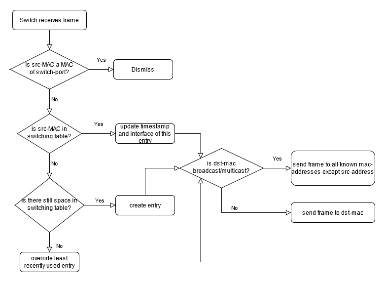

# Project "Networking: 01 - Switch": Software Documentation

## Group 3

**Team Members**

| Name | First Name | Role in this sprint |
|---|---|---|
| Herold | Nicole | Scrum Master |
| Müller | Mac | Developer |
| Vogt | Rebecca Tabea | Developer |

**Revision History**

| Version   | Date          | Description           | Author        |
|-----------|---------------|-----------------------|---------------|
| 1.0       | Mai 1, 2021  | Template              | Rebecca Vogt  |
| 2.0       | Mai 14, 2021  | Definitive version              | Nicole Herold, Rebecca Vogt, Mac Müller  |

## Table of Content

1. **[Introduction](#heading--1)**

   1.1 [Requirements](#heading--1-1)
   1.1 [Targeted Audience](#heading--1-2)

2. **[Technical Details](#heading--2)**

   2.1 [Data structure for Switching table](#heading--2-1)
   2.2 [Switching Algorithm](#heading--2-2)

3. **[Testing](#heading--3)**

   3.1 [Test strategy](#heading--3-1)
   3.2 [Test cases](#heading--3-2)
   
   3.2.1 [Test cases: A newly connected device sends a broadcast](#heading--3-2-1)
   3.2.2 [Test cases: Sending a frame with a dst-address which is in switching table per unicast](#heading--3-2-2)
   3.2.3 [Test cases: Sending a frame with a destination MAC-address which is not in switching table](#heading--3-2-3)
   3.2.4 [Test cases: Load testing with 100 MAC-addresses](#heading--3-2-4)
   3.2.5 [Test cases: Sending incomplete Frame (frame length shorter than header)](#heading--3-2-5)
   3.2.6 [Test cases: A device that is already known is plugged into another port](#heading--3-2-6)

4. **[Scrum artifacts](#heading--4)**

   4.1 [Product/sprint backlog](#heading--4-1)

   

## 1. Introduction

### 1.1 Requirements

A program switch which forwards frames received on any interface to any other 
interface, but passively learns MAC addresses and optimizes subsequent traffic.
It should support:

 * Multicast and broadcast (here referred to as the same)
 * Changing external connections (re-learning when devices move around the network)
 * Managing an "attacker" process that sends from billions of MAC addresses by ensuring the switch’s learning table uses finite memory

### 1.2 Targeted Audience

* Users who instead of buying a switch want to implement their own switch with 4 ports
  and understand the switching mechanisms better

## 2. Technical Details

### 2.1 Data structure for Switching table

A structure switching_connection was created containing the interface (consisting of port number and its own MAC-address), the client MAC-address
currently connected to this port and a timestamp to mark when this specific instance of the structure was last used. 
The table itself was realized as an array of switching_connections. We decided to use an array consisting of 16 indices - after 16 entries have been added, 
the least recently used entry will be replaced by a new entry. Each time a client contacts the switch, the switch checks, whether the port for this 
MAC-address has changed and the timestamp is updated. 

### 2.2 Switching Algorithm

The switching algorithm is visualized in the following diagrams. 
As soon as a frame arrives, the switch checks if the source MAC-address is one of its own MAC-addresses. 
If this is the case, no further action is taken. 

If it is no MAC-address of the switch, the switch searches in the switch table if the MAC-address is already in it. If so the timestamp and interface will be updated.
If no matching MAC-address is found, the new MAC-address is added in case the switching table is not full yet. If the table is full, the least recently used entry is 
searched for by its timestamp and replaced by the new entry.

After the source-MAC-address is checked, the next step is to check if the destination Mac-address is a broadcast/multicast address. This is done by checking if the last bit of the most significant byte (LG Bit) 
is set to 1 (broadcast/multicast) or 0 (unicast). If the LG Bit is set, the frame will send to all known MAC-addresses except the source address. 
Otherwise the frame will only be sent to the destination MAC-address if the latter is known to the switch. If the destination MAC-address for a unicast reauest is not known by the switch, 
the frame will be sent via broadcast/multicast. 

**Diamond diagram**

**UML-State diagram switch**

## 3. Testing

 * public-test-switch: A public test case, run using ./public-test-switch ./switch"
to test your switch. Returns 0 on success.
 * public-switch: Reference implementation of the switch.
 * public-bug-switch: Buggy implementation of a switch.

### 3.1 Test strategy

The tests were implemented to find and correct errors in our own switch implementation and to test the reference implementation public-switch and public-bug-switch. 
These are "development tests" which are used to discover bugs and other flaws of the respective implementations. 

### 3.2 Test cases

#### 3.2.1 Test case: A newly connected device sends a broadcast

| **Test Case ID:** 1 |
|----|
| **Summary:** A newly connected device sends a broadcast. |
| **Pre-requisites:** First connection to the switch. |
| **Test steps:** 1. Device is sending a frame; 2. Switch gets the frame; 3. Writes the src-MAC-address in switching table; 4. Sending the frame to all network participants except the src-MAC-address from which the frame was sent. |
| **Expected Results:** The frame is sent to all network participants except the one who was sending the broadcast message.  |
| **Author:** Nicole Herold |
| **Automation:** none |
| **Status:** Passed 2021-05-13 |

#### 3.2.2 Test case: Sending a frame with a dst-address which is in switching table per unicast

| **Test Case ID:** 2 |
|----|
| **Summary:** Sending a frame with a dst-address which is in switching table per unicast. |
| **Pre-requisites:** Dst-address contained in switching table. |
| **Test steps:** 1. Send a frame with a dst-address which is in switching table; 2. Check, whether the frame is sent via unicast to the correct MAC-address on the correct interface |
| **Expected Results:** The frame is received in stdout via the correct interface |
| **Author:** Rebecca Vogt |
| **Automation:** none |
| **Status:** Passed 2021-05-13 |

#### 3.2.3 Test case: Sending a frame with a destination MAC-address which is not in switching table

| **Test Case ID:** 3 |
|----|
| **Summary:** Sending a frame with a destination MAC-address which is not in switching table. |
| **Pre-requisites:** Destination MAC-address not contained in switching table. |
| **Test steps:** 1. Send a frame with a destination MAC-address which is not in switching table; 2. Check, whether the frame is sent via broadcast 3. Check, whether other devices receive frame. |
| **Expected Results:** All interfaces get a broadcast-frame |
| **Author:** Mac Müller |
| **Automation:** none |
| **Status:** Passed 2021-05-13 |

#### 3.2.4 Test case: Load testing with 100 MAC-addresses

| **Test Case ID:** 4 |
|----|
| **Summary:** Load testing with 100 MAC-addresses |
| **Pre-requisites:** none |
| **Test steps:** 1. Send from 100 different destination MAC-addresses to broadcast with the help of a loop; 2. Check, whether last frame is received via broadcast |
| **Expected Results:** No errors are encountered, 200 frames from switch received, correctly MAC-address of the last frame |
| **Author:** Mac Müller |
| **Automation:** none |
| **Status:** Passed 2021-05-14 |

#### 3.2.5 Test case: Sending incomplete Frame (frame length shorter than header)

| **Test Case ID:** 5 |
|----|
| **Summary:** Sending incomplete Frame (frame length shorter than header) |
| **Pre-requisites:** Src-MAC-address known by switch |
| **Test steps:** 1. Send an incomplete frame 2. Check, whether output length matches the size of a normal frame |
| **Expected Results:** Output length does not match expected frame size |
| **Author:** Rebecca Vogt |
| **Automation:** none |
| **Status:** Passed 2021-05-13 |

#### 3.2.6 Test case: A device that is already known is plugged into another port

| **Test Case ID:** 6 |
|----|
| **Summary:** A device that is already known is plugged into another port |
| **Pre-requisites:** Src-MAC-address already known by switch |
| **Test steps:** 1. Changed device send a frame to another known device (switch should recognize the new Port of the changed device) 2. A completely different device sends a frame to the repositioned device 3. Check, whether the frame was received at all / on the correct interface |
| **Expected Results:** Receive the frame on the correct interface |
| **Author:** Nicole Herold |
| **Automation:** none |
| **Status:** Passed 2021-05-14 |

## 4. Scrum Artifacts

### 4.1 Product/Sprint Backlog

 1. Choose a data structure
 2. Choose an algorithm
 3. Complete switch.c
     * create struct switching_connection
     * create array switching_table
 4. Develop test strategy
     * Test 1-6
 5. Implement Tests
