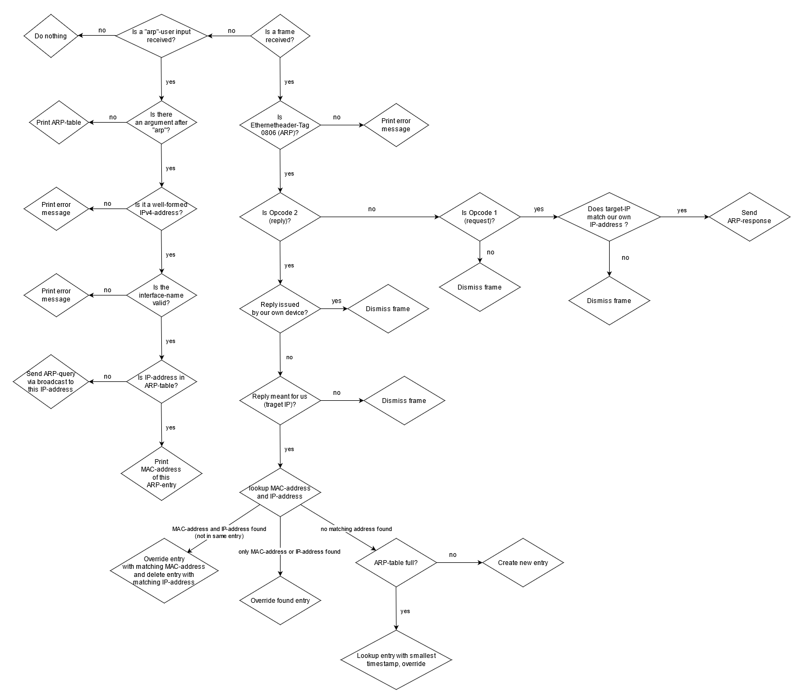

# Project "Networking: 02 - ARP": Software Documentation

## Group 3

**Team Members**

| Name | First Name | Role in this sprint |
|---|---|---|
| Herold | Nicole | Developer |
| Müller | Mac | Scrum Master |
| Vogt | Rebecca Tabea | Developer |

**Revision History**

| Version   | Date          | Description           | Author        |
|-----------|---------------|-----------------------|---------------|
| 1.0       | Mai 21, 2021  | Template              | Rebecca Vogt  |

## Table of Content

1. **[Introduction](#heading--1)**

   1.1 [Requirements](#heading--1-1)\
   1.1 [Targeted Audience](#heading--1-2)

2. **[Technical Details](#heading--2)**

   2.1 [Data structure for ARP](#heading--2-1)\
   2.2 [ARP Algorithm](#heading--2-2)

3. **[Testing](#heading--3)**

   3.1 [Test strategy](#heading--3-1)\
   3.2 [Test cases](#heading--3-2)
   
   3.2.1 [Integration Tests](#heading--3-2-1)\
   3.2.2 [Automated Tests](#heading--3-2-2)

4. **[Scrum artifacts](#heading--4)**

   4.1 [Product/sprint backlog](#heading--4-1)

5. **[Miscellaneous](#heading--5)**   

   5.1 [Glossary](#heading--5-1)

## 1. Introduction

### 1.1 Requirements

An ARP (Address Resolution Protocol) algorithm, which handles ARP-requests and ARP-responses and manages an ARP-table. Each table entry shall 
match an IPv4-address with the corresponding MAC-address of a known device in the same network.

The algorithm is able to: 
1. Watch for ARP queries on the ethernet link and handle them accordingly i.e. create a new entry in ARP-table or 
   update an entry.
2. Respond to ARP-requests meant for your own IP address.
3. Manage an ARP cache which contains MAC-addresses already known and their respective IPv4-addresses. A new entry is
   generated whenever an ARP-reply meant for our own IP-address reaches our device.
4. Manage a user input “arp” by printing the whole ARP-table.
5. Manage a user input “arp _[IPv4-address]_ _[interface name]_” of an IP-address contained in ARP-table by printing the matching MAC-address (if contained in ARP-table).
6. Manage a user input “arp _[IPv4-address]_ _[interface name]_” of an IP-address _not_ contained in ARP-table 
   by sending out an ARP-query via broadcast to this IP-address.
   

### 1.2 Targeted Audience

* Users who would like to have a deeper insight into the inner workings of the devices we use every day. This easy to understand C-code
provides a better understanding of the ARP-mechanism which is crucial to communicating in a network.

## 2. Technical Details

### 2.1 Data structure for ARP

An ARP-table in the form of an array which contains ARP-entries. An entry contains an IPv4-address and the corresponding MAC-address
of a connected device, the interface the device is connected to as well as a timestamp, when the entry was created
or updated. The table can contain up to 10 entries - this is defined in a constant variable which defines the maximum amount of entries. 
There is als an entry counter which is incremented each time an entry is added and decremented if an entry is deleted. 
If the table is full, the entry with the lowest (= oldest) timestamp is looked up and gets overwritten. For each new entry or update, the algorithm checks, if the IP-address _or_ the MAC-address
already exists. As a MAC-address and an IP-address has to be unique within the table, entries will be overwritten or even 
deleted if necessary.

### 2.2 ARP Algorithm

The ARP-algorithm handles ARP-requests and ARP-responses and manages an ARP-table. By checking the type-tag in the Ethernet header
it determines if the received frame contains an Address Resolution Protocol (ARP). If this is the case, it determines whether 
the ARP is a request or a reply by its opcode (_1_ for request, _2_ for reply). 

#### 2.2.1 Handling ARP-queries on the Ethernet link

If a **reply (opcode 2)** is received, it will filter out the replies which are sent from our own IP and dismiss them. It will also check, of the reply is meant for us according to the target-IP. 
If it is not, it will be dismissed. All other replies are handled as follows: The MAC-address and the IP-address contained in
the ARP-reply as target-MAC and target-IP are looked up in the ARP table. 
  * Case 1: The target-IP-address is found in an existing entry, and the target-MAC-address is found in another existing entry.
     * The found entry with the same MAC-address is overwritten by the new entry. The found entry with the same IP-address is 
      deleted. This means from this entry onwards each entry will be overwritten by the following entry. The entry counter (effective amount
       of table entries) is decremented by one.
  * Case 2: Only the target-MAC-address or only the IP-address is found in an existing entry of the table.
     * This entry is overwritten by the new entry.
  * Case 3: Neither the target-IP-address, nor the target-MAC-address is found in the table.
     * If the table is not full (the entry counter is smaller than the maximum amount of entries), a new entry is created.
     * If the table is full (the entry counter is equal to or greater than the maximum amount of entries) the entry with the 
       smallest (this is the oldest) timestamp is overwritten with the new entry.

If a **request (opcode 1)** is received, it will check whether the target-IP-address matches the IP-address of one of its own interfaces.
If there is no match, the request will be dismissed. If there is a match, an ARP-response is set up and sent to the MAC-address that was specified
as sender MAC-address in the ARP-request. 

#### 2.2.2 Handling ARP user inputs

While the program is running, users may type the following commands into the console:

  * _arp_: The ARP-table is printed to stdout.
  * _arp_ _[IPv4-address]_ _[interface name]:_  
    * If the IP-address is in the ARP-table, the program will print out the matching MAC-address
    * If the IP-address is not in the ARP-table, an ARP-query is sent via broadcast to this IP-address
   
In case one of these parameters is missing, the IPv4 address is malformed, or the interface name does not match one of our own 
interfaces an error message will be displayed. 

**Diamond diagram algorithm**

## 3. Testing

 * public-test-arp (provided by Prof. Grothoff): A public test case, run using _./public-test-arp ./arp_ to test your ARP. Returns 0 on success
 * public-arp (provided by Prof. Grothoff): Reference implementation of the ARP-algorithm
 * public-bug-arp (provided by Prof. Grothoff): Buggy implementation of the ARP-algorithm
 * test-arp: Automated test-cases to test our ARP-implementation as well as public-arp and public-bug-arp.

### 3.1 Test strategy

The tests were implemented to find and correct errors in our own ARP implementation and to test the reference implementation public-arp and public-bug-arp. 
These are "development tests" which are used to discover bugs and other flaws of the respective implementations. 

### 3.2 Test cases

#### 3.2.1 Integration Tests

Integration Tests were conducted with the help of other devices and Wireshark.

| **Test Case ID:** 1 |
|----|
| **Summary:** Ping another device and receive ARP-reply. |
| **Pre-requisites:** ARP table does not contain the specified IP- and MAC-address. |
| **Test steps:** 1. We send an ARP-query asking for a reply; 2. Device sends a response; 3. Handle response by creating a new entry in ARP-table; |
| **Expected Results:** The requests and response should be displayed correctly in Wireshark. The MAC-address and the corresponding IPv4-address should be in the ARP-table.  |
| **Screenshots:**    |
| **Author:**  Nicole Herold |
| **Automation:** none |
| **Status:** Passed 2021-05-30 |

| **Test Case ID:** 2 |
|----|
| **Summary:** Receive an ARP-request from a connected device and send a reply. |
| **Pre-requisites:** ARP-table of connected device does not contain our MAC-address. |
| **Test steps:** 1. A connected device sends an ARP-request containing our IP-address; 2. Send an ARP-response; 3. Connected device adds our IP-/MAC-address to its ARP-cache |
| **Expected Results:** Our MAC- and IP-address is in the ARP-table of the connected device. The requests and response should be displayed correctly in Wireshark. |
| **Author:**  Rebecca Vogt |
| **Automation:** none |
| **Status:** Passed 2021-05-25 |

| **Test Case ID:** 3 |
|----|
| **Summary:** The ARP-table should be displayed if a user types _arp_ into the command line. |
| **Pre-requisites:** ARP-table must be filled with entries. |
| **Test steps:** 1. Flush ARP-table; 2. Send a few ARP-requests to connected devices; |
| **Expected Results:** Check in Wireshark, if all the ARP-replies are displayed in the table. |
| **Author:**  Mac Müller |
| **Automation:** none |
| **Status:** Passed 2021-05-30 |
| **Screenshot:**  |

| **Test Case ID:** 4 |
|----|
| **Summary:** An ARP-request has to be sent via broadcast if a user types _arp_ _[IPv4-address]_ _[IF-name]_ into the command line and the IPv4-address is not in the table yet. |
| **Pre-requisites:** The IPv4-address belongs to a device in the same network. The IPv4-address is not in the ARP-table yet. |
| **Test steps:** 1. Flush ARP-table; 2. Type _arp_ _[IPv4-address]_ _[IF-name]_  into console; |
| **Expected Results:** Wireshark should display the request and reply. The IP-address and the corresponding MAC-address must appear in the table.  |
| **Screenshots:**    |
| **Author:**  Nicole Herold |
| **Automation:** none |
| **Status:** Passed 2021-05-30 |

| **Test Case ID:** 5 |
|----|
| **Summary:** The MAC-address is displayed if a user types _arp_ _[IPv4-address]_ _[interface name]_ into the command line. |
| **Pre-requisites:** The IPv4-address and corresponding MAC-address is already in the table. The interface name is a valid interface name of our own device. |
| **Test steps:** 1. Type _arp_ _[IPv4-address]_ _[interface name]_ into console; |
| **Expected Results:** The corresponding MAC-address must appear on the console. |
| **Author:**  Rebecca Vogt |
| **Automation:** none |
| **Status:** Passed 2021-05-25 |

#### 3.2.2 Automated Tests

Not all the planned automated tests could be implemented. Despite continued efforts, the team did not manage to find the cause of some major errors which caused the 
tests to run unsuccessfully.

| **Test Case ID:** 6 (not fully implemented) |
|----|
| **Summary:** Send ARP-query to device in same network and receive ARP-reply. |
| **Pre-requisites:** ARP table does not contain the specified IP- and MAC-address. |
| **Test steps:** 1. We send an ARP-query asking for a reply; 2. Device sends a response; |
| **Expected Results:** The MAC-address and the corresponding IPv4-address should be in the ARP-reply |
| **Author:**  Nicole Herold |
| **Automation:** Automated test |
| **Status:** Not fully implemented |

| **Test Case ID:** 7 (not implemented) |
|----|
| **Summary:** Send an ARP-reply not meant for the tested device (different IP). |
| **Pre-requisites:** The destination-IP-address of the ARP-reply is not the IP-address of the device. |
| **Test steps:** 1. We send an ARP-reply with an IP that does not match the tested device |
| **Expected Results:** The IP-Address of the sent reply does not appear in the ARP-cache of the tested device |
| **Author:** Rebecca Vogt |
| **Automation:** Automated test |
| **Status:** Not implemented |

| **Test Case ID:** 8 |
|----|
| **Summary:** Small loading to test ARP-cache with 11 ARP-replies. |
| **Pre-requisites:** 11 ARP-replies are sent to the ARP-algorithm. |
| **Test steps:** 1. Send 11 replies with different IP- and MAC-addresses; 2. Send Command: _$arp_ _[last IPv4-address]_ _[interface name]_;|
| **Expected Results:** MAC-Address of the last-IP-address. |
| **Author:** Mac Müller |
| **Automation:** none |
| **Status:** Passed 2021-05-30 |

| **Test Case ID:** 9 (not implemented)|
|----|
| **Summary:** ARP-Table is printed if user types "arp". |
| **Pre-requisites:**  There are entries in the ARP-table |
| **Test steps:** 1. Fill the ARP-table with replies;  |
| **Expected Results:** The ARP-entries of the replies should be displayed in the table (stdout) |
| **Author:** Rebecca Vogt |
| **Automation:** none |
| **Status:** Not implemented |

## 4. Scrum Artifacts

### 4.1 Product/Sprint Backlog

 1. Choose a data structure
 2. Choose an algorithm
 3. Complete arp.c
      * create struct ArpEntry 
      * create array arpCache
 4. Develop test strategy
      * Integration Tests 1-5
      * Automated Tests 6-9
 5. Implement Tests

## 5. Miscellaneous

### 5.1 Glossary

| Term | Explanation |
|---|---|
| ARP | Address Resolution Protocol: A Layer 2 (OSI-model) network protocol. An ARP-table/cache is stored in a device which contains all known IP-Adresses and MAC-Addresses to which the device is connected to |
| ARP-cache / ARP-table | A data structure containing up to 10 MAC- and IPv4-addresses of connected devices known so far |
| ARP-request / ARP-query | A broadcast request issued by any client in a network to find out, which MAC-address belongs to a certain IPv4-address |
| ARP-response / ARP-reply | A response issued as answer to an ARP-request with matching IPv4-Address as destination |

