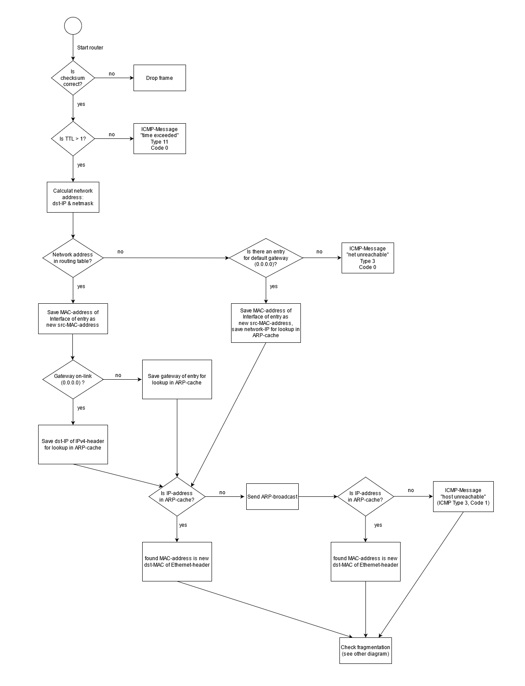
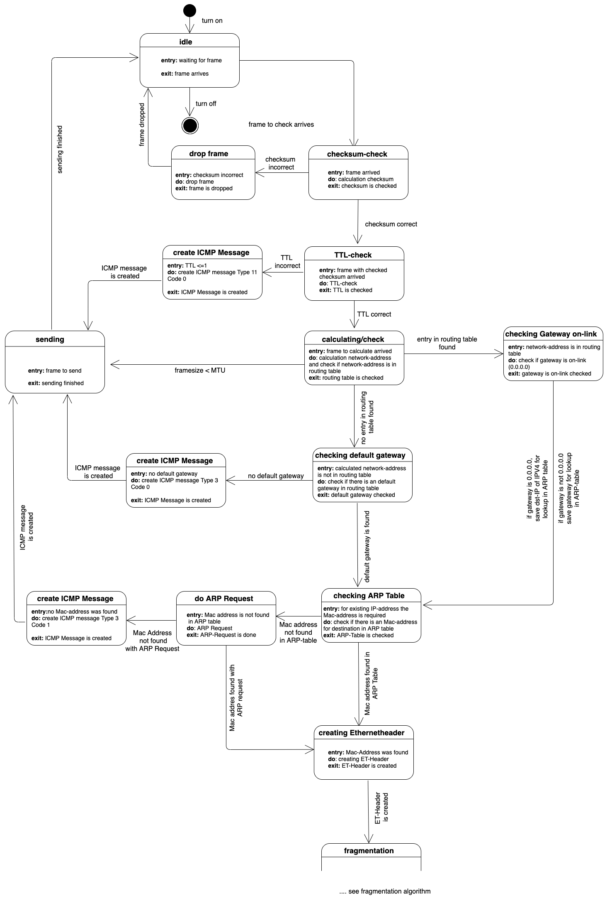
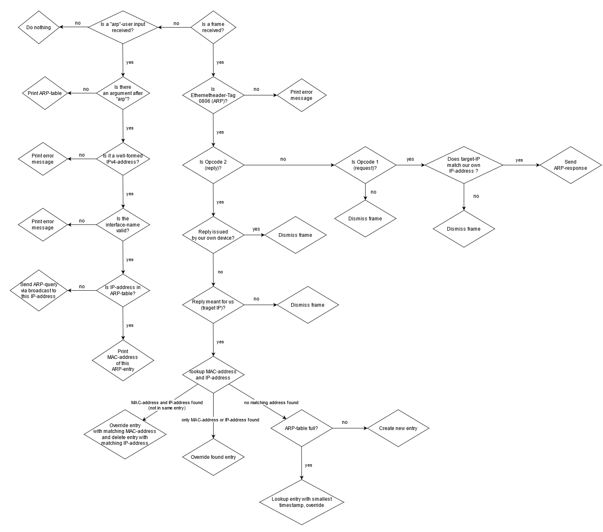
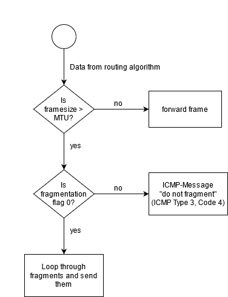
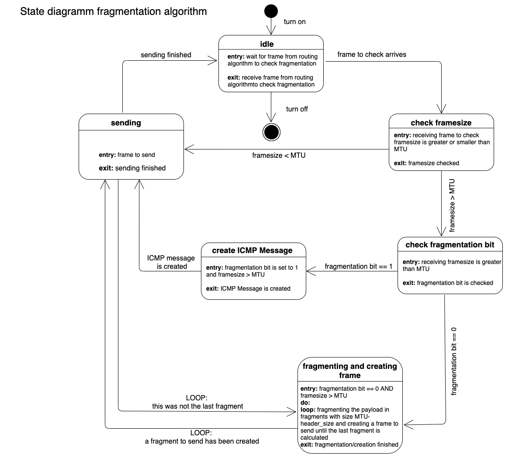
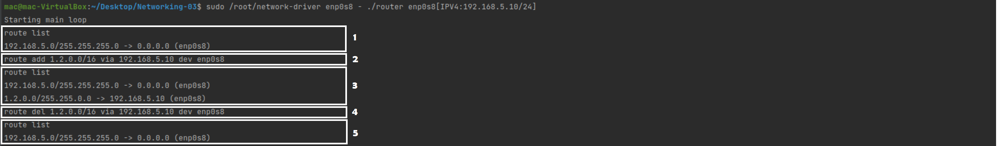

# Project "Networking: 03 - Router": Software Documentation

## Group 3

**Team Members**

| Name | First Name | Role in this sprint |
|---|---|---|
| Herold | Nicole | Developer |
| Müller | Mac | Developer |
| Vogt | Rebecca Tabea | Scrum Master |

**Revision History**

| Version   | Date          | Description           | Author        |
|-----------|---------------|-----------------------|---------------|
| 1.0       | June 19th, 2021  | Template              | Rebecca Vogt  |
| 2.0       | June 19th, 2021  | Final Version              | Rebecca Vogt  |

## Table of Content

1. **[Introduction](#heading--1)**

   1.1 [Requirements](#heading--1-1)\
   1.1 [Targeted Audience](#heading--1-2)

2. **[Technical Details](#heading--2)**

   2.1 [Data structure for Routing table](#heading--2-1)\
   2.2 [Routing Algorithm](#heading--2-2)

3. **[Testing](#heading--3)**

   3.1 [Test strategy](#heading--3-1)\
   3.2 [Test cases](#heading--3-2)
   
   3.2.1 [Integration Tests](#heading--3-2-1)\
   3.2.2 [Automated Tests](#heading--3-2-2)

4. **[Scrum artifacts](#heading--4)**

   4.1 [Product/sprint backlog](#heading--4-1)

5. **[Miscellaneous](#heading--5)**   

   5.1 [Glossary](#heading--5-1)

## 1. Introduction

### 1.1 Requirements

A routing algorithm, which handles incoming IPv4-packets and routes them. It can also lookup addresses in the ARP-table, which handles ARP-requests and 
ARP-responses. The routing algorithm manages a routing table where network targets and their gateways/next hops as well as information about the interface are stored.

The router shall provide the following functionalities:

1. A routing table is maintained: Upon startup, the interfaces given via the command line arguments are 
   included in the table. These routes are not deleteable. When the programm is running, the user is able to add routing entries manually, 
   provided they match the necessary criteria. 

   
2. Different kinds of user entries are provided which can be entered while the program is running:
   
   * **route list:**
   If the user enters the command `route list` all the routing table entries are listed.
   
   * **route add:**
   Routes must be entered in the following format:
   `route add 1.2.0.0/16 via 192.168.0.1 dev eth0`
   whereas the first IP-address represents a network-address and the prefix (netmask) via the gateway dev the interface name.
   
   * **route del:**
   Routes must be entered in the following format:
   `route del 1.2.0.0/16 via 192.168.0.1 dev eth0`
   whereas the first IP-address represents a network-address and the prefix (netmask) via the gateway dev the interface name.
   If the route is undeleteable or one of these parameters is incorrect, the route will not be deleted.

   * **define maximum transmission unit (MTU) upon startup:**
   Upon startup, the user can optionally add the syntax `IFC[RO]=MTU` after interface name where MTU is the MTU for the interface. 
   Example: `eth0=1500`

3. Basic IP handling (TTL, ICMP, Checksum) is provided, including: Forwarding, routing, address resolution and caching.
   

4. IP fragmentation is provided: The standard MTU/the MTU via user input is checked and the packet is fragmented if necessary.

5. The ARP logic from last sprint is used to resolve the target MAC address. IP packets for destinations where the next hop’s MAC address has not yet
   been learned are dropped. ARP requests are issued to obtain the destination’s MAC.
   The ARP algorithm is able to: 
   * Watch for ARP queries on the ethernet link and handle them accordingly i.e. create a new entry in ARP-table or update an entry.
   * Respond to ARP-requests meant for your own IP address.
   * Manage an ARP cache which contains MAC-addresses already known and their respective IPv4-addresses. A new entry is generated whenever an ARP-reply meant for our own IP-address reaches our device.
   * Manage a user input `arp` by printing the whole ARP-table.
   * Manage a user input `arp [IPv4-address] [interface name]` of an IP-address contained in ARP-table by printing the matching MAC-address (if contained in ARP-table).
   * Manage a user input `arp [IPv4-address] [interface name]` of an IP-address _not_ contained in ARP-table by sending out an ARP-query via broadcast to this IP-address.
   

### 1.2 Targeted Audience

Users who would like to have a deeper insight into the inner workings of the devices we use every day. This easy to understand C-code
provides a better understanding of the routing-mechanism which is crucial to communicating in a network.

## 2. Technical Details

### 2.1 Data structure for routing table

A routing table in the form of a linked list which contains routing entries. An entry contains:

  * A network target address which is calculated by adding the network mask to the target IP-address.
  * A network mask which is entered with the parameters upon startup of the router or by the command `route add`.
  * A gateway / next hop where traffic to a sepcific network target address should be directed to. If the network target address is within the same network, 0.0.0.0 is entered (on-link address).
  * An interface which is the physical port to this gateway.
  * A variable `undeleteable` which is set to 1 if it is an entry provided through the command line arguments upon startup.
  * A pointer to the next routing entry.

### 2.2 Routing Algorithm

The routing algorithm handles IPv4-packets and manages a routing table. 

#### 2.2.1 Handling IPv4-packets on the Ethernet link

Upon startup of the router initializes its table with the provided interfaces. 

**Checksum:**
If an IPv4-packet is received the checksum is calculated. If it does not match the checksum provided in the IPv4-header, the packet is dismissed. 

**time-to-live (TTL):**
Next, the time-to-live (TTL) is checked. It must never be smaller than one, since with every hop a packet takes, the TTL is reduced by one. A packet received with a TTL of one therefore means, we can
not route the packet any further. If the TTL is equal to or smaller than one, an ICMP-message of the type 11 ("time exceeded") is issued and
sent back to the destination address. 

**Network target**:
Then the network address of the IPv4-header is calculated. The network address can be calculated by the following logical operation:
`destiantion IP-address AND netmask`. This network address is then looked up in the routing table. 
* If it is found in the table, it is checked whether it is an on-link address - which means, the address is within the same network and the entry for gateway/next hop is 0.0.0.0. 
  * If it is an on-link-address, the destination-IP from the IPv4-header is saved for the next step.
  * If it is not an on-link-address, the gateway/next hop is saved for the next step.
    
* If it is not found in the table, a possible standard gateway is looked up: Is there an entry with 0.0.0.0 as gateway / next hop? 
  * If there is a standard gateway, its network address is saved and the MAC-address of the interface is saved to be used as src-MAC-address for the Ethernet header.
  * If there is not standard gateway, an ICMP-Message of type 3 ("net unreachable") is issued and sent back to the destination address.

**Diamond diagram algorithm**

**State diagram algorithm**

#### 2.2.2 Looking up the MAC-address in the ARP-table

For this next step, the algorithm uses the values stored in the last steps described in 2.2.1. The IP-address saved from the routing table is looked up in the ARP-cache.
* If it is not found, an ARP-request via broadcast is issued. Then the address is looked up again in the ARP-table. If it can still not be found, this means, that this device is not reachable. 
That is why in this case an ICMP-message of type 3 ("host unreachable") is issued. If it is found after the broadcast, the algorithm continues as if it was found in the first place.
* If it is found, the MAC-address belonging to this IP-address in the ARP-table is saved.

**Diamond diagram algorithm**

#### 2.2.3 Fragmentation

We now have the IP-address and the MAC-address where the packet should be routed to. First, it is checked, whether the MTU is smaller than the actual frame size.
* If this is the case, it is checked next, whether the packet should be fragmented. This is done by checking the fragmentation bit in the IPv4-header: If it is 0, 
  fragmentation is allowed (default), if it is 1, fragmentation is not allowed. In case the packet is bigger than MTU, but is not allowed to be fragmented, an ICMP-message of type 3 ("do not fragment") is issued.
  In all other cases, the packet can be fragmented.
*  If this is not the case, the frame can be forwarded.

**Fragmentation process:**
The size of each fragment is calculated: `MTU - Ethernet-header size(14) - IPv4-header size(20)`
The number of fragments is calculated: `Payload : fragment size` - in case payload%fragment size is not zero, add one.

The algorithm loops through all the fragments:
* For each fragment the offset is calulated: `packet-number (starting at 0) * (frame size/8)`.
* The payload is at this offset cropped to the fragment size and packet into the frame.
* Fragment ID is incremented by one.
* Check whether it is the last packet:
  * If it is, set the last-fragment bit to 1.
  * If it is not, set the last-fragment bit to 0.
* Calculate the new checksum and add it.
* Send the packet.

**Diamond diagram algorithm**

**State diagram algorithm**

## 3. Testing

 * public-test-router (provided by Prof. Grothoff): A public test case, run using ``./public-test-router ./router`` to test the routing algorithm. Returns 0 on success.
 * public-router (provided by Prof. Grothoff): Reference implementation of the routing algorithm.
 * public-bug-router (provided by Prof. Grothoff): Buggy implementation of the routing algorithm.

### 3.1 Test strategy

A non-automated test was made to find and correct errors in the routing implementation. 
For this sprint, no automated tests were implemented, but test-cases are described below for possible later implementation.  

### 3.2 Test cases

#### 3.2.1 Integration Tests

Integration Tests were conducted with the help of other devices and Wireshark.

| **Test Case ID:** I1 |
|----|
| **Summary:** Test user commands `route list`, `route add`, `route del` |
| **Pre-requisites:** Router is running, there are routing table entries that can be displayed |
| **Test steps:** 1. show route list 2. add a valid routing entry 3. show route list 4. delete a routing entry 5. show route list |
| **Expected Results:** The routing table should be displayed correctly after adding and deleting entry |
| **Screenshots:**   |
| **Author:**  Mac Müller |
| **Automation:** none |
| **Status:** passed 2021-06-19 |

#### 3.2.2 Automated Tests

The automated tests could not be implemented. 

| **Test Case ID:** A1 |
|----|
| **Summary:** Forward frame  |
| **Pre-requisites:** IPv4-network-address is in routing table, does not have to be fragmented |
| **Test steps:** 1. We send an IPv4-packet 2. the packet gets forwarded |
| **Expected Results:** The frame is forwarded |
| **Author:**  - |
| **Automation:** Automated test |
| **Status:** Not implemented |

| **Test Case ID:** A2 |
|----|
| **Summary:** Send IPv4-packet which dst-network address is not in routing table |
| **Pre-requisites:** The dst-network address of the packet is not in routing table and no standard gateway is defined |
| **Test steps:** 1. We send an IPv4-packet 2. we check, whether an ICMP-message was sent |
| **Expected Results:** ICMP-Message "net unreachable" (ICMP Type 3, Code 0) |
| **Author:**  - |
| **Automation:** Automated test |
| **Status:** Not implemented |

| **Test Case ID:** A3 |
|----|
| **Summary:** Send IPv4-packet with "do not fragment"-Bit set to 1 (must not be fragmented) and payload size is greater than MTU |
| **Pre-requisites:** "do not fragment"-Bit is set to 1, payload size is greater than MTU |
| **Test steps:** 1. We send an IPv4-packet 2. we check, whether an ICMP-message was sent ||
| **Expected Results:** ICMP-Message "do not fragment" (ICMP Type 3, Code 4) |
| **Author:** - |
| **Automation:** Automated test |
| **Status:** Not implemented |

| **Test Case ID:** A4 |
|----|
| **Summary:** IP-fragmentation |
| **Pre-requisites:** "do not fragment"-Bit is set to 0, payload size is greater than MTU |
| **Test steps:** 1. We send an IPv4-packet which size is greater than MTU 2. The packet is sent in fragments |
| **Expected Results:** Correct amount and size of fragments |
| **Author:** - |
| **Automation:** Automated test |
| **Status:** Not implemented |

| **Test Case ID:** A5 |
|----|
| **Summary:** Packet with TTL <= 1 |
| **Pre-requisites:** The ttl of the IPv4-packet is set to 1 |
| **Test steps:** 1. We send an IPv4-packet with TTL 1 2. We receive an ICMP-Message |
| **Expected Results:** Receive ICMP-Message "time exceeded" (ICMP Type 11, Code 0) |
| **Author:** - |
| **Automation:** Automated test |
| **Status:** Not implemented |

| **Test Case ID:** A6 |
|----|
| **Summary:** Packet with wrong checksum |
| **Pre-requisites:** The checksum of the IPv4-packet is wrong (calculate with wrong size) |
| **Test steps:** 1. We send an IPv4-packet with a wrong checksum 2. Frame gets dropped |
| **Expected Results:** The sent frame must not be received since it gets dropped |
| **Author:** - |
| **Automation:** Automated test |
| **Status:** Not implemented |

## 4. Scrum Artifacts

### 4.1 Product/Sprint Backlog

 1. Choose a data structure.
 2. Choose an algorithm.
 3. Complete router.c
      * create struct Routing_entry.
 4. Develop test strategy:
      * Integration Tests I1-I2.
      * Automated Tests A1-A6.
 5. Implement Tests.

## 5. Miscellaneous

### 5.1 Glossary

| Term | Explanation |
|---|---|
| ARP | Address Resolution Protocol: A Layer 2 (OSI-model) network protocol. An ARP-table/cache is stored in a device which contains all known IP-Adresses and MAC-Addresses to which the device is connected to |
| ARP-cache / ARP-table | A data structure containing up to 10 MAC- and IPv4-addresses of connected devices known so far |
| ARP-request / ARP-query | A broadcast request issued by any client in a network to find out, which MAC-address belongs to a certain IPv4-address |
| ARP-response / ARP-reply | A response issued as answer to an ARP-request with matching IPv4-Address as destination |
| Gateway / next hop | The next hop IP-Address a packet has to be sent to. The on-link gateway is 0.0.0.0 and indicates, that this device is in the same network. If it is not it indicates the next router |
| ICMP | Internet Control Message Protocol: Layer 3-protocol (OSI-model) for transmission of error feedback, is added to IPv4-header since does not have its own header type |
| IPv4 | Internet Protocol version 4: Layer 3-protocol (OSI-model) for data transmission |
| MTU | Maximum Transmission Unit: The maximum size of a packet fragment |
| Routing | Find the next hop / gateway for a network address |
| TTL | Time-to-live: It must never be smaller than one upon arrival, since with every hop a packet takes, the TTL is reduced by one |
